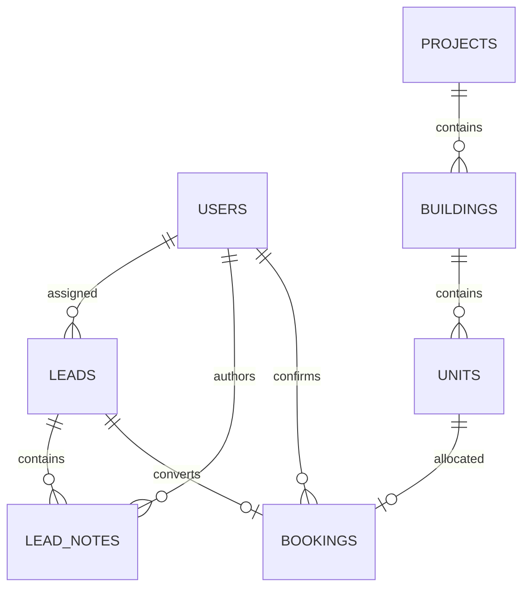

# Database and API overview

## Relationships



| Entity | Important fields / constraints |
| --- | --- |
| users | unique email, BCrypt hash, ADMIN/SALES role |
| leads | name, phone, optional email, stage, assigned user, next follow-up, timestamps |
| lead_notes | lead, author, text up to 2000 characters, timestamp |
| projects | name, location |
| buildings | project FK; unique name within project |
| units | building FK; unique unit number within building; positive decimal price; AVAILABLE/BOOKED |
| bookings | unique lead FK, unique unit FK, employee FK, positive price snapshot, timestamp |

Refer to `V1__initial_schema.sql` for exact DDL, foreign keys, checks and indexes. No cascading deletes are defined and the API does not expose delete endpoints.

## Endpoint contract

All responses are JSON except successful operations returning 204. Authentication uses a session cookie. All writes, including login and logout, require a CSRF token from `GET /api/auth/csrf`. The response provides the header name and token; send both exactly as returned. Retrieve a fresh token after login.

| Method | Endpoint | Purpose |
| --- | --- | --- |
| GET | `/api/health` | Process health; no database readiness guarantee |
| GET | `/api/auth/csrf` | Initialize session and get CSRF token |
| POST | `/api/auth/login` | `{email,password}`; returns current user |
| POST | `/api/auth/logout` | Invalidate session; 204 |
| GET | `/api/auth/me` | Current user ID, name, email, role |
| GET | `/api/employees` | Sales employee choices; Admin only |
| GET | `/api/leads?q=&stage=&assignee=&page=0` | Scoped search; `{items,total,page,size}` |
| POST | `/api/leads` | Create a lead owned by current user; returns `{id}` |
| GET | `/api/leads/{id}` | Lead detail including notes and booking array |
| PUT | `/api/leads/{id}` | Replace editable lead fields; 204 |
| PATCH | `/api/leads/{id}/assignee` | `{employeeId}`; Admin only; 204 |
| POST | `/api/leads/{id}/notes` | `{text}`; returns `{id}` |
| GET | `/api/properties` | `{projects,buildings,units}` inventory |
| POST / PUT | `/api/projects` / `/api/projects/{id}` | `{name,location}`; Admin only |
| POST / PUT | `/api/buildings` / `/api/buildings/{id}` | `{projectId,name}`; Admin only |
| POST / PUT | `/api/units` / `/api/units/{id}` | `{buildingId,unitNumber,type,price}`; Admin only |
| POST | `/api/bookings` | `{leadId,unitId}`; returns `{id}` |
| GET | `/api/bookings` | Scoped confirmed booking list |
| GET | `/api/dashboard` | Scoped counts, stages, booked value, first ten due/overdue follow-ups |

Lead create/update body:

```json
{
  "name": "Example Buyer",
  "phone": "+91 9000000000",
  "email": "buyer@example.test",
  "stage": "INTERESTED",
  "nextFollowUp": "2026-09-10"
}
```

Stages: `NEW`, `CONTACTED`, `SITE_VISIT`, `INTERESTED`, `NEGOTIATION`, `BOOKED`, `LOST`. `BOOKED` is accepted on update only if the lead is already booked. Dates use `YYYY-MM-DD`; email and nextFollowUp may be null. The frontend uses full `PUT` updates, so missing nullable fields clear those values. There is no general stage/availability override endpoint.

An inaccessible lead returns 404 to avoid revealing whether another employee's record exists. Admin-only actions return 403. Missing authentication returns 401. Invalid input returns 400 with a message and, for field validation, a `fields` map. Conflicting or locked records return 409; unexpected errors return a generic 500 message and are logged on the backend.

## Booking consistency

The public service method is invoked through Spring's transaction proxy. It locks an existing lead row before checking ownership and eligibility, then locks the existing unit row before checking availability. Both locks remain until transaction completion. A successful insert and both status updates commit together. Any runtime database failure rolls them back. No outbound calls occur while locks are held.

A second request for the same unit waits, then sees BOOKED and returns 409. A second request for the same lead similarly sees BOOKED. Database uniqueness also protects against an alternative writer accidentally inserting a duplicate. The same lead lock serializes reassignment, lead updates and notes with booking so permission checks are not performed against an unlocked lead during writes.

Bookings are visible according to the lead's **current assignee**, while `booked_by` retains the original employee. Admin can always see all bookings. This is a customer-ownership view, not an employee commission report.

## Reference documentation

- [MySQL locking reads](https://dev.mysql.com/doc/refman/8.4/en/innodb-locking-reads.html)
- [Spring Security authentication persistence](https://docs.spring.io/spring-security/reference/servlet/authentication/persistence.html)
- [Spring Security CSRF](https://docs.spring.io/spring-security/reference/servlet/exploits/csrf.html)
